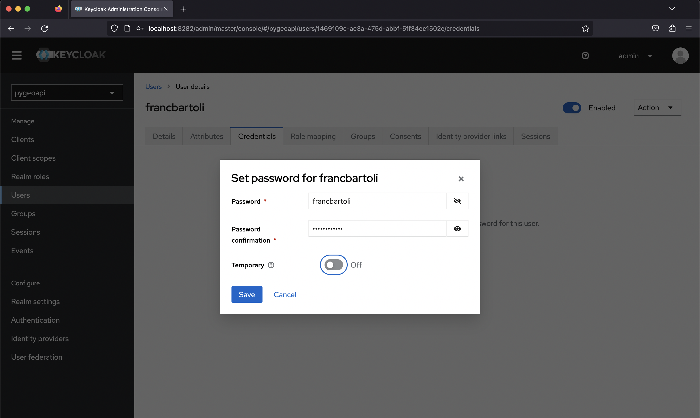
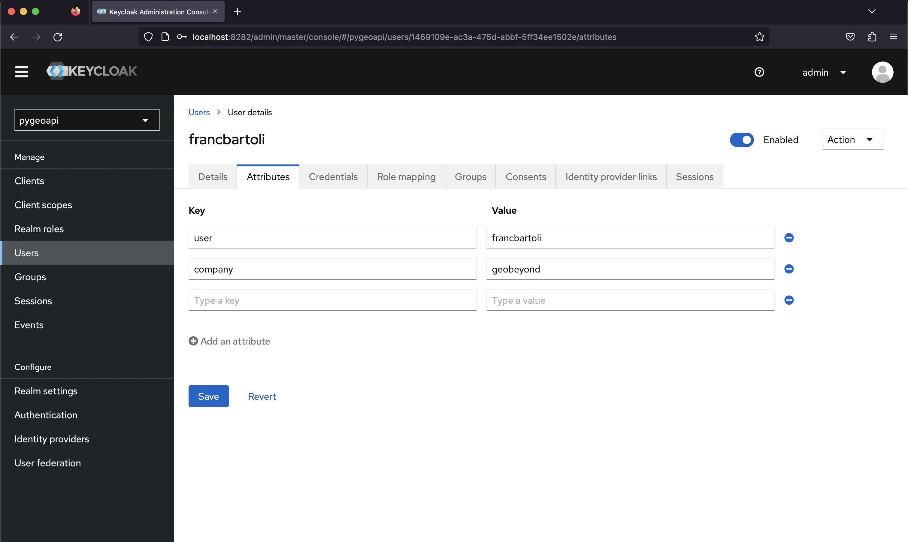
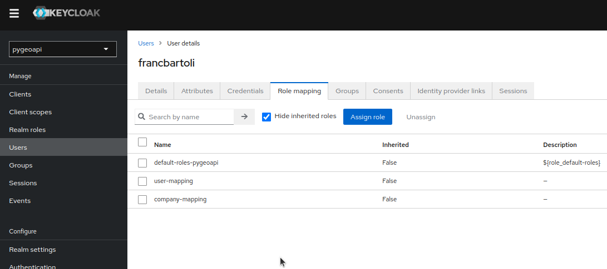
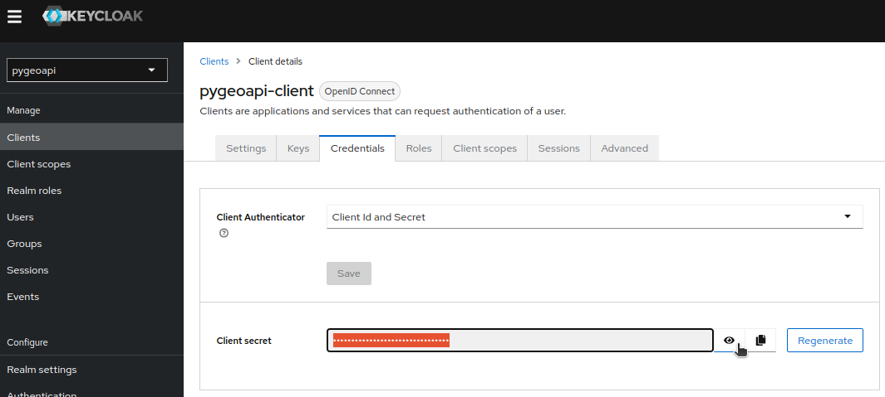

## How to use Keycloak and Open Policy Agent

## Run Keycloak and OPA together

From the root go to the folder `scripts/iam`:

```shell
docker compose up -d
```

Alternatively, you can run separately Keycloak with the following command:

```shell
docker[podman] run --rm --name keycloak -p 8282:8080 \
  -e KEYCLOAK_ADMIN=admin -e KEYCLOAK_ADMIN_PASSWORD=admin \
  quay.io/keycloak/keycloak:latest \
  start-dev
```

and Open Policy Agent with the Rego file for authorization rules:

```shell
docker[podman] run --rm --name opa -p 8383:8181 \
  -v ./policy:/policy \
  openpolicyagent/opa:latest \
  run --server --log-level debug /policy/auth.rego
```

## Configure Keycloak

Open the administration interface at `http://localhost:8282/admin/master/console/` and access with the credentials `admin/admin`.

---

**NOTE**

1. If you are using the provided Docker setup, the Keycloak realm JSON file will be automatically loaded during startup. This file contains the realm configuration, including the realm name and settings. However, if you are using a different Keycloak setup, follow the steps below to manually create/import the realm and

2. To provide better support for Docker environments, we have made updates to the Keycloak setup. One important change is the inclusion of persistent storage for the database using PostgreSQL. This ensures that any changes made to Keycloak configuration or data will be preserved even after restarting the Docker container.

---

### Create a new realm

- _Add realm_ with the name `pygeoapi` and click on the _Create_ button
  
- In the _Clients_ menu under _Manage_ click on the button _Create_ on the _Clients list_ tab, then click the _Create client_ button and fill **Client ID** with `pygeoapi-client`. Then click _Next_.
  
  

- Click on the item just created and in the _settings_ tab

  - Set _Client authentication_ to `On`
  - Set _Root URL_ to `http://localhost:5000`
  - Set _Valid Redirect URIs_ to `http://localhost:5000/*`
  - Set _Admin URL_ to `http://localhost:5000`
  - Set _Web Origins_ to `http://localhost:5000/*`
  - Click the _Save_ button
    

- Set _client_id_ and _client_secret_ in the configuration of the _Credentials_ tab.

### Create new users

Click on the _Users_ menu in the list of the left panel


- Click the _Create new user_ button and fill the _Username_ with the value `francbartoli` then click _Create_


- Click on the tab _Credentials_
  - Set _Password_ to `francbartoli`
  - Set _Temporary_ to `off`



- Click on the tab _Attributes_

  - Set key/value
    - `user=francbartoli`
    - `company=geobeyond`



- Add _Username_ with value `tomkralidis`
- On the tab _Credentials_
  - Set _Password_ to `tomkralidis`
  - Set _Temporary_ to `off`
- On the tab _Attributes_
  - Set key/value
    - `user=tomkralidis`
    - `company=osgeo`

### Create the mapping roles

Under the tab _Realm roles_ of the new realm set the following roles:

- Name: user-role
- Name: company-role


Click on the button _Create role_ and fill in the _Role name_ field and the attributes that are designed to be used in the new realm (i.e. `user`, `company`, etc).

When the role is saved, it's necessary to associate it with both user _francbartoli_ and _tomkralidis_ in Users section.

For each user, in the tab Role Mapping of User Details:

- Click on the button _Assign role_
- Assign roles _user-role_ and _company-role_



## Update the policy

If there are changes in the `auth.rego` then restart the OPA server

```shell
docker-compose stop opa
docker-compose up -d
```

### Company-based authorization policy

Let's imagine our users have some attributes, for example, the `company` where they are working. In this case, we'd like to use it for authorization purposes. If certain rules are added to the policy file, such as:

- allow users from company `osgeo` to access only the collection `obs`

```rego
allow {
    some collection
    input.request_path[0] == "collections"
    input.request_path[1] == collection
    collection = "obs"
    input.company == "osgeo"
}
```

- allow users from company `geobeyond` to access only the collection `lakes`

```rego
allow {
    some collection
    input.request_path[0] == "collections"
    input.request_path[1] == collection
    collection = "lakes"
    input.company == "geobeyond"
}
```

### Policy example

This is a complete and very simple policy for the above example with protected collections only:

```rego
# policy/auth.rego
package httpapi.authz

# HTTP API request
import input
default allow = false

# Allow anyone to root and static files
allow {
    input.request_path = [""]
    input.request_method == "GET"
}

allow {
    input.request_path[0] == "static"
    input.request_path[1] == "img"
    input.request_method == "GET"
}

allow {
    input.request_path[0] == "static"
    input.request_path[1] == "css"
    input.request_method == "GET"
}

# allow anyone to the collections metadata
allow {
    input.request_path = ["collections"]
    input.request_method == "GET"
}

# allow rules for different collections
allow {
    some collection
    input.request_path[0] == "collections"
    input.request_path[1] == collection
    collection = "obs"
    input.company == "osgeo"
}

allow {
    some collection
    input.request_path[0] == "collections"
    input.request_path[1] == collection
    collection = "lakes"
    input.company == "geobeyond"
}
```

## Get Access Token

Get the `client secret` from Keycloack, in Clients -> Client details go to Credetials Tab and show / copy the value:



To set environment variables do the following, replacing `client_id` with the `client secret`:

```shell
export KC_RESPONSE=$(curl -X POST 'http://localhost:8282/realms/pygeoapi/protocol/openid-connect/token' \
 -H "Content-Type: application/x-www-form-urlencoded" \
 -d "username=francbartoli" \
 -d 'password=francbartoli' \
 -d 'grant_type=password' \
 -d 'client_id=pygeoapi-client' \
 -d 'client_secret=2yholx8r3mqyUJaOoJiZhcqvQDQwmgyD' \
 -d 'response_type=code id_token token company' \
 -d 'scope=openid profile email' | jq -r '.')
```

Then obtain the different response objects:

```shell
KC_ACCESS_TOKEN=$(echo $KC_RESPONSE| jq -r .access_token)
KC_ID_TOKEN=$(echo $KC_RESPONSE| jq -r .id_token)
KC_REFRESH_TOKEN=$(echo $KC_RESPONSE| jq -r .refresh_token)
```

Verify that the user information is correct:

```shell
curl -X GET 'http://localhost:8282/realms/pygeoapi/protocol/openid-connect/userinfo' -H "Content-Type: application/x-www-form-urlencoded" -H "Authorization: Bearer $KC_ACCESS_TOKEN" | jq .
```

you would get something like this:

```json
{
  "sub": "1469109e-ac3a-475d-abbf-5ff34ee1502e",
  "email_verified": false,
  "company": "geobeyond",
  "preferred_username": "francbartoli",
  "given_name": "",
  "user": "francbartoli",
  "family_name": ""
}
```

## Get pygeoapi collections

Get all collections:

```shell
curl -X GET 'http://localhost:5000/api/collections' \
-H "Content-Type: application/x-www-form-urlencoded" \
-H "Authorization: Bearer $KC_ACCESS_TOKEN" | jq .
```

Get the `lakes` collection:

```shell
curl -X GET 'http://localhost:5000/api/collections/lakes' \
-H "Content-Type: application/x-www-form-urlencoded" \
-H "Authorization: Bearer $KC_ACCESS_TOKEN" | jq .
```

you would get the following content:

```json
{
  "id": "lakes",
  "title": "Large Lakes",
  "description": "lakes of the world, public domain",
  "keywords": ["lakes", "water bodies"],
  "links": [
    {
      "type": "text/html",
      "rel": "canonical",
      "title": "information",
      "href": "http://www.naturalearthdata.com/",
      "hreflang": "en-US"
    },
    {
      "type": "application/json",
      "rel": "self",
      "title": "This document as JSON",
      "href": "http://localhost:5000/api/collections/lakes?f=json"
    },
    {
      "type": "application/ld+json",
      "rel": "alternate",
      "title": "This document as RDF (JSON-LD)",
      "href": "http://localhost:5000/api/collections/lakes?f=jsonld"
    },
    {
      "type": "text/html",
      "rel": "alternate",
      "title": "This document as HTML",
      "href": "http://localhost:5000/api/collections/lakes?f=html"
    },
    {
      "type": "application/json",
      "rel": "queryables",
      "title": "Queryables for this collection as JSON",
      "href": "http://localhost:5000/api/collections/lakes/queryables?f=json"
    },
    {
      "type": "text/html",
      "rel": "queryables",
      "title": "Queryables for this collection as HTML",
      "href": "http://localhost:5000/api/collections/lakes/queryables?f=html"
    },
    {
      "type": "application/geo+json",
      "rel": "items",
      "title": "items as GeoJSON",
      "href": "http://localhost:5000/api/collections/lakes/items?f=json"
    },
    {
      "type": "application/ld+json",
      "rel": "items",
      "title": "items as RDF (GeoJSON-LD)",
      "href": "http://localhost:5000/api/collections/lakes/items?f=jsonld"
    },
    {
      "type": "text/html",
      "rel": "items",
      "title": "Items as HTML",
      "href": "http://localhost:5000/api/collections/lakes/items?f=html"
    }
  ],
  "extent": {
    "spatial": {
      "bbox": [[-180, -90, 180, 90]],
      "crs": "http://www.opengis.net/def/crs/OGC/1.3/CRS84"
    },
    "temporal": {
      "interval": [["2011-11-11T11:11:11+00:00", null]]
    }
  },
  "itemType": "feature"
}
```

while getting the `obs` collection:

```shell
curl -X GET 'http://localhost:5000/api/collections/obs' \
-H "Content-Type: application/x-www-form-urlencoded" \
-H "Authorization: Bearer $KC_ACCESS_TOKEN" | jq .
```

the result is a deny since the user works for the company `geobeyond` and the collection `obs` is only accessible to the `osgeo` company:

```json
{
  "message": "Unauthorized"
}
```
